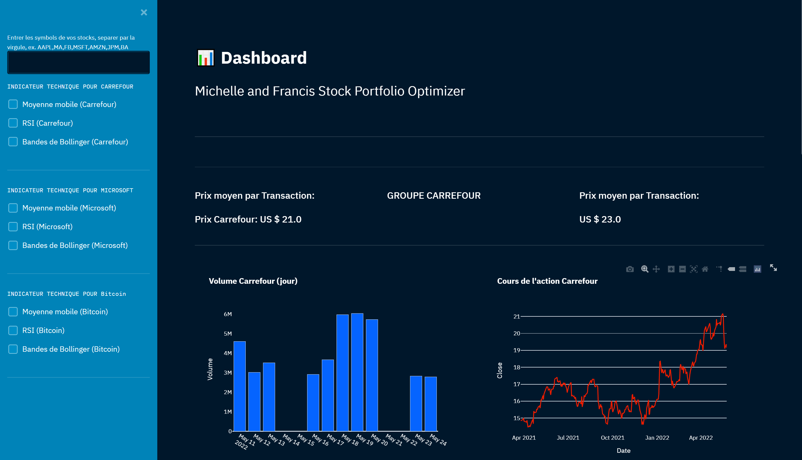
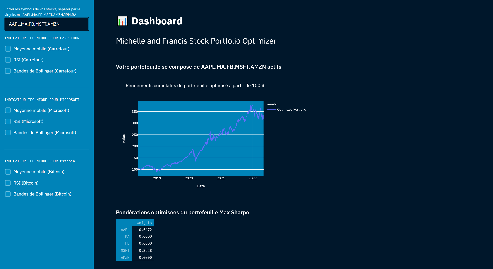
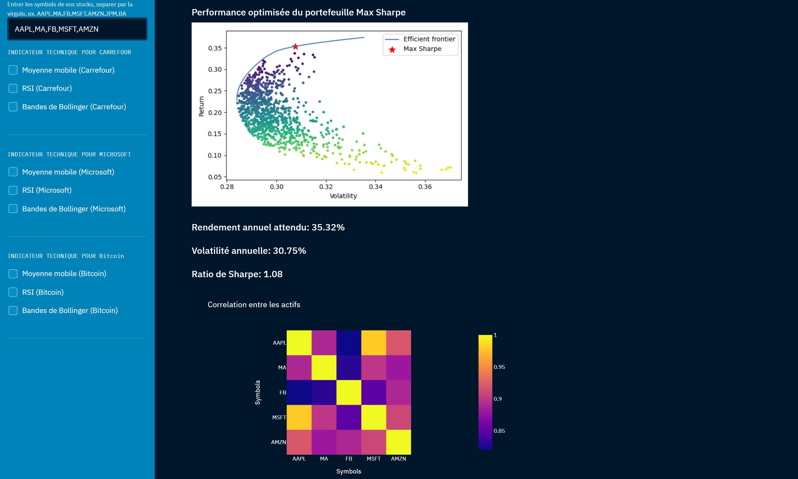
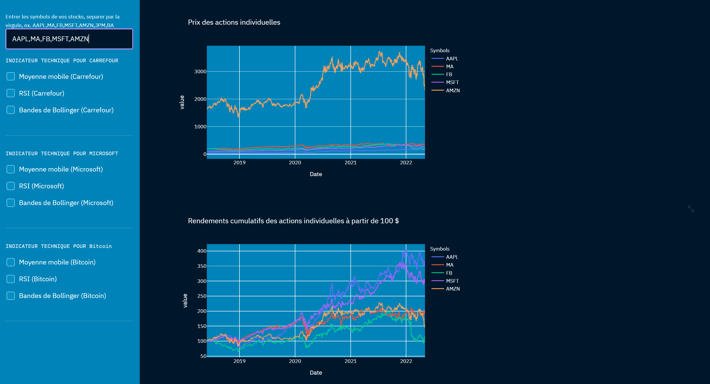

# PROJET PYTHON ESG FINANCE

Vous travaillez dans une entreprise financière qui vous demande de faire un tableau de bord de suivi d'actif en python
 
**Objectif**: Le but est de permettre de visualiser de manière interactif un ou plusieurs actifs de votre choix (actions, devises, etc.)



L'utilisateur pourra choisir une ou plusieurs métriques à visualiser (moyenne roulante, indicateur financier, etc.)
Pour cela vous devrez : 


# Questions:

1. collecter des données
2. les charger dans le tableau de bord
3. permettre un affichage des données interactifs.
4. Vous pourrez utiliser un outil tel que streamlit pour faire le tableau de bord.
5. Vous devrez également calculer des métriques financières classiques sur ces cours.
 
# Solutions
### 1. collecter des données : Utilisation de l'API YAHOO FINANCE
```python
 import yfiance as yf
 from pandas_datareader.data import DataReader

# Exemple de récuperation des données financieres de Microsoft
data = yf.Ticker('MSFT')
Microsoft = data.history(period='max')
```
### 2. les charger dans le tableau de bord : Utilisation de Streamlit
```bash
pip install streamlit
```

```python
 import streamlit as st

# Affichage donnée finance avec streamlit
data = yf.Ticker('MSFT')
Microsoft = data.history(period='max')
st.write(Microsoft)
```
### 3. permettre un affichage des données interactifs.
```python
 import streamlit as st
```

### 4. collecter des données : Utilisation de l'API YAHOO FINANCE
```python
 import yfiance as yf
```
- Récuperation des données financières en temps reel

### 5. LES METRIQUES

## - Prix Individuel du portefeuille

```python
.
```
## - Performance Optimisée du Portefeuille avec le Ratio Sharpe plus Correlation entre les actifs

```python
.
```
## -  Evolution du prix des actifs

```python
.
```
# Lancement du projet 
Pour lancer le projet, Veuillez lancer la commande ci-dessous dans le terminal
```bash
deploy.bat
```
Le fichier deploy.bat contient toute les commandes de lancement du projet.


Rendez vous dans votre localhost:8501, server par default de Streamlit

```bash
http://localhost:8501/
```